# APS CHEATSHEET

# ARCHITETTURA LOGICA

La progettazione di un tipico sistema orientato agli oggetti è basata su diversi
strati architetturali, come uno strato dell’interfaccia utente, uno strato della
logica applicativa (o "del dominio") e così via.
L'architettura logica può essere illustrata sotto forma di diagrammi dei package di UML, come parte del Modello di Progetto, e magari riassunta come
vista nel Documento dell’Architettura Software. I’input principale sono le
forze architetturali raccolte nelle Specifiche Supplementari. L’architettura
logica definisce i package all’interno dei quali sono definite le classi software.

Uno strato è un gruppo a grana molto grossa di classi, package o sottosistemi, che ha delle
responsabilità coese rispetto a un aspetto importante del sistema. Inoltre
gli strati sono organizzati in modo tale che strati "più alti" (come lo strato
dell’interfaccia utente) ricorrano ai servizi degli strati "più bassi", mentre
normalmente non avviene il contrario.
In un sistema OOP si hanno normalmente i seguenti strati:

- **User Interface**

- **Application Logic e Domain Objects**, ovvero ogetti software che
  rappresentano concetti del dominio (per esempio, una classe software
  Sale) che soddisfano i requisiti dell’applicazion

-  **Technical Services**, ovvero oggetti e sot,tosistemi d’uso generale che forniscono servizi tecnici di supporto, come l’interfacciamento con una
  base di dati o il logging degli errori. Questi servizi sono solitamente
  indipendenti dall’applicazione e riusabili in diversi sistemi

In un’architettura a strati stretta, uno strato può solo richiamare i servizi dello strato immediatamente sottostante. Questa struttura è comune nei
protocolli di rete organizzati a pila, ma non nei sistemi informatici, che normalmente utilizzano un’architettura a strati rilassata, in cui uno strato
più alto puo richiamare i servizi di strati più bassi di diversi livelli.
Un’architettura logica non deve necessariamente essere organizzata a strati, ma molto spesso lo è.

Un diagramma dei package di UML fornisce un modo per raggruppare degli
elementi. Un package UML può raggruppare qualunque cosa: delle classi,
altri package, casi d’uso e così via. È molto comune anche l’annidamento di
package. Il concetto di package in UML è più generale che non quello di un semplice package Java o di un namespace .NET; i package
di UML possono rappresentare tutti questi, nonché altre cose.

Un package UML rappresenta un namespace (”spazio dei nomi”) in modo
che due classi abbiano lo stesso nome se vivono in due package diversi.
Talvolta non è opportuno disegnare il rettangolo di un package esterno attorno ai package interni. Vediamo le idee essenziali per la progettazione a strati:

- organizzare la struttura logica su larga scala di un sistema in strati separati con responsabilità distinte e correlate, con una separazione netta e coesa degli interessi, come per esempio il fatto che gli strati "inferiori" sono servizi generali e di basso livello, mentre gli strati superiori sono più specifici per l’applicazione

-  collaborazioni e accoppiamenti vanno dagli strati più alti a quelli più
  bassi, l’iverso viene evitato

Vengono inoltre affrontati diversi problemi con l’uso degli strati:

- le modifiche al codice sorgente si propagano in tutto il sistema; molte
  parti del sistema sono altamente accoppiate

- la logica applicativa è intrecciata con l’interfaccia utente, per cui non
  può essere riusata con un’interfaccia diversa oppure distribuita su un
  altro nodo di elaborazione

- i servizi tecnici o la logica di business potenzialmente generali sono
  intrecciati con una logica più specifica per l’applicazione, per cui non
  può essere riusata, distribuita su un altro nodo o sostituita in modo
  semplice con un’implementazione differente

- c’è un accoppiamento alto tra diverse aree di interesse. Pertanto è difficile suddividere il lavoro, con dei confini precisi, tra i vari sviluppatori

Vediamo anche i vantaggi:

- in generale, c’è una separazione degli interessi, una separazione tra servizi
  di alto e di basso livello e tra servizi generali e quelli più specifici per
  l’applicazione. Questo riduce l’accoppiamento e le dipendenze, migliora
  la coesione, aumenta la possibilità di riuso e aumenta la chiarezza

- la complessità relativa a questi aspetti è incapsulata e può essere de-
  composta

-  alcuni strati possono essere sostituiti da nuove implementazioni. Gene-
  ralmente ciò non è possibile per gli strati di basso livello dei Technical
  Services (Servizi Tecnici) o Foundation), ma è possibile per gli strati
  UI, Application (Applicazione) e Domain (Dominio)

- gli strati più bassi contengono funzioni riusabili

- alcuni strati (in primo luogo Domain e Technical Services) possono
  essere distribuiti

- lo sviluppo da parte dei team è favorito dalla segmentazione logica

Nella programmazione ad oggetti l’approccio consigliato consiste nel creare
degli oggetti software con nomi e informazioni simili al dominio del mondo
reale, e assegnare a essi responsabilità della logica applicativa. Un oggetto
software di questo tipo è chiamato un oggetto di dominio. Esso rappresenta una cosa nello spazio del dominio del problema, e ha una logica applicativa
o di business correlata. Progettando gli oggetti in questo modo si arriva a
uno strato della logica applicativa che può essere chiamato, in modo più preciso, strato del dominio dell’architettura, ovvero lo strato.

Il principio di Separazione Modello-Vista afferma che gli oggetti
del modello (dominio) non devono avere una conoscenza diretta
degli oggetti della vista (UI), almeno in quanto oggetti della vista. Si hanno due punti:

1. gli oggetti non UI non devono essere connessi o accoppiati direttamente agli oggetti UI. Infatti le finestre sono relativa ad una applicazione specifica, mentre (idealmente) gli oggetti non appartenenti all’interfaccia grafica possono essere riusati in nuove applicazioni o vi si può accedere mediante una nuova interfaccia

2. non mettere logica applicativa nei metodi di un oggetto dell’interfaccia utente. Gli oggetti UI devono solo inizializzare gli elementi dell’interfaccia utente, ricevere eventi UI e delegare le richieste di logica agli oggetti non UI

## GRASP

Si ha l'RDD (*Responsability-Drive-Development*) basata su:

- **responsabilità:** astrazione di ciò che si deve saper fare; gli oggetti hanno responsabilità

- **ruoli:** l' obiettivo o la capacità che un oggetto o una classe ha di partecipare ad una relazione con un altro oggetto; obblighi e comportamenti di un oggetto sono assegnati in base al ruolo

- **collaborazioni:** gli oggetti collaborano per il raggiungimento di un obiettivo

Approfondendo il discorso responsabilità, che si assegnano durante la modellazione o durante la codifica, si hanno:

- **responsabilità di fare:**
  
  - *fare qualcosa esso stesso:* eseguire un calcolo;creare/modificare/eliminare oggetti di tipo omogeneo
  
  - *dare inizio a un’azione in altri oggetti:* inizializzare dei componenti
  
  - *controllare e coordinare le attività di altri oggetti:* avviare una procedura di calcolo concorrente ed attendere che tutti termino

- **responsabilità di conoscere:** 
  
  - conoscere i propri dati privati incapsulati
  
  - conoscere gli oggetti correlati
  
  - conoscere cose che può derivare o calcolare

- **granularità delle responsabilità:**
  
  - granularità fine: aggiungere un metodo ad una classe
  
  - granularità grossa: progettazione di numerose classi

**Contesto UML:** le responsabilità sono individuate mentre si creano i modelli statici e dinamici del sistema:

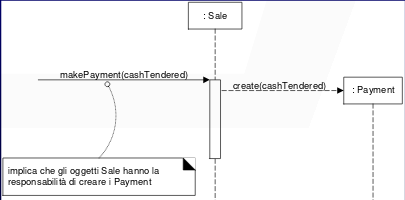

Vediamo i pattern GRASP principali:

- **information expert:** che si occupa di assegnare le responsabilità all’esperto delle informazioni, ovvero alla classe che possiede le informazioni necessarie per soddisfare le responsabilità. Si ha che modellare il comportamento dinamico del sistema spesso porta all’individuazione di ulteriori responsabilità e buone scelte portano alla creazione di classi facili da comprendere, mantenere, estendere e riusare
  
  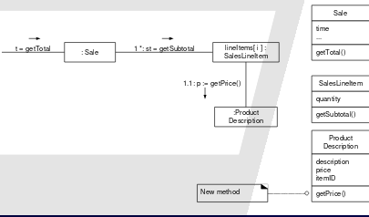
  
  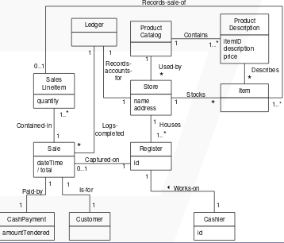

- **creator:** che si occupa di assegnare a B la responsabilità di creare istanze di tipo A sulla base delle seguenti condizioni, una o più:
  
  - B contiene o aggrega con una composizione oggetti di tipo A
  
  - B utilizza stettamente A
  
  - B possiede i dati per l’inizializzazione di A
  
  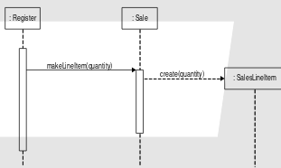
  
  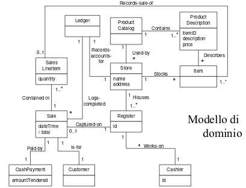

- **low coupling:** che si occupa di accoppiamento. L’accoppiamento indica quanto fortemente un elemento è connesso ad altri elementi, ha conoscenza di altri elementi e dipende da altri elementi. Classi con alto accoppiamento comportano:
  
  - i cambiamenti in classi correlate obbligano a cambiamenti locali
  
  - sono difficili da comprendere in isolamento
  
  - sono difficili da riusare perché il loro riuso richiede anche il riuso delle classi da cui dipendono
  
  quindi si assegna responsabilità in modo da mantenere l’accoppiamento basso.
  
  A livello implementativo si introducono degli accoppiamenti quando:
  
  - un oggetto A ha un attributo o referenzia un oggetto B
  
  - un oggetto A invoca servizi di B
  
  - un oggetto A implementa un metodo che utilizza un parametro, una variabile locale o ritorna un oggetto B
  
  - un oggetto è istanza di una classe C1 che a sua volta è sottoclasse (diretta o indiretta) di una classe C2
  
  - un oggetto è istanza di una classe C1 che implementa una interfaccia I
  
  E si ha disaccoppiamento estremo. Low Coupling estremizzato può portare alla creazione di oggetti molto grandi e complessi che eseguono tutto il lavoro da soli portando a pessimi progetti con bassa coesione e progetti difficili da comprendere o mantenere

- **high cohesion:** dove la coesione indica quanto siano correlate e concentrate le responsabilità di un elemento:
  
  - un elemento con responsabilità altamente correlate che non esegue una quantità di lavoro eccessiva ha coesione alta
  
  - una classe con coesione bassa fa molte cose non correlate tra loro o svolge troppo lavoro:
    
    - difficili da comprendere
    
    - difficili da riusare
    
    - difficili da mantenere
    
    - continuamente soggette a cambiamenti
  
  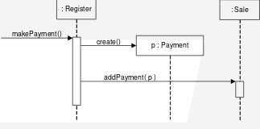
  
  quindi abbiamo:
  
  - **coesione molto bassa:** una classe è la sola responsabile di molte cose in aree funzionali molto diverse
  
  - **coesione bassa:** una classe ha da sola la responsabilità di un compito complesso in una sola area funzionale
  
  - **coesione moderata:** una classe ha da sola responsabilità leggere in poche aree diverse, che sono logicamente correlate al concetto rappresentato dalla classe, ma non l’una con l’altra
  
  - **coesione alta:** una classe ha responsabilità moderate in un’unica area funzionale e collabora con le altre per svolgere i suoi compiti
  
  **Una classe con coesione alta ha un numero di metodi relativamente basso, con delle funzionalità altamente correlate, e non fa troppo lavoro. Essa collabora con altri oggetti per condividere lo sforzo, se il compito è grande.** Un sistema può essere decomposto in moduli (componenti) coesi e debolmente accoppiati

- **controller:** un controller è il primo “oggetto” oltre lo strato di UI che è responsabile di ricevere e gestire gli eventi. Si occupa scegliere e creare un oggetto che rappresenta il sistema complessivo o sottoinsieme. Un oggetto controller può rappresentare uno scenario di un caso d’uso invece del sottosistema. Si hanno le seguenti resposabilità:
  
  - il controller implementa le operazioni a livello utente
  
  - conosce quali servizi devono essere eseguiti in corrispondenza di una certa operazione utente
  
  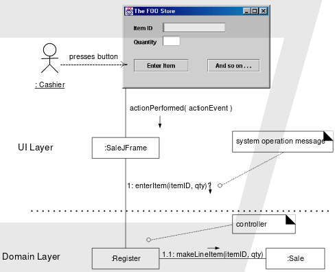Si hanno i seguenti vantaggi:
  
  - la logica applicativa non è gestita nello strato di interfaccia
  
  - riuso della logica (svincolata dalla UI)
  
  - si possono utilizzare interfacce diverse
  
  - se si usano controller basati sui caso d’uso è possibile verificare che le operazioni si susseguano in una sequenza legale e ragionare sullo stato corrente delle attività
  
  e si ha l'errore dei controller "gonfi":
  
  - esiste una unica classe controller che riceve tutti i numerosi eventi di sistema
  
  - il controller svolge parte del lavoro prima di delegarlo
  
  - il controller ha numerosi attributi e conserva informazioni sul sistema e sul dominio
  
  ## DESIGN PATTERN
  
  Si ha la seguente differenza:
  
  - **pattern:**
    
    - descrive un problema specifico che ricorre più volte
    
    - descrive il nucleo della soluzione a quel problema in modo da poter utilizzare tale soluzione molte voltesenza mai applicarla nello stesso modo
  
  - **design pattern:**
    
    - regola tripartita
    
    - esprime una relazione tra contesto problema e soluzione
    
    - nomina, astrae identifica aspetti chiave di una struttura di design comune
    
    - identifica classi e istanze che partecipano, ruoli, modalità di collaborazione e distribuzione delle responsabilità
  
  ## 
  
  Sono divisi in 3 categorie:
  
  1) **creational**, pattern che forniscono un'astrazione del processo di instanziazione degli oggetti. Permettono di rendere un sistema indipendente da come gli oggetti sono creatirappresentati composti al suo interno:
     
     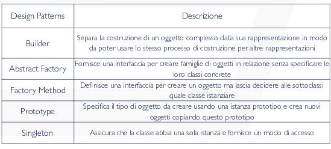
  
  2) **structural**, dedicati alla composizione di classi e oggetti per formare strutture complesse. È possibile creare delle classi che ereditano da più classi per consentire di utilizzare proprietà di più superclassi indipendenti. Sono particolarmente utili per fare in modo che librerie di classi sviluppate indipendentemente posano operare insieme:
     
     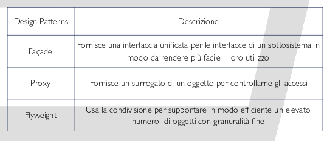
  
  3) **behavioral**, che sono dedicati all'assegnamento di responsabilità tra gli oggetti e alla creazione di algoritmi. Si ha la caratteristica comune: supporto fornito per seguire le comunicazioni che avvengono tra gli oggetti. L'utilizzo di questi pattern permette di dedicarsi principalmente alle connessioni tra oggetti, tralasciando la gestione dei flussi di controllo:
     
     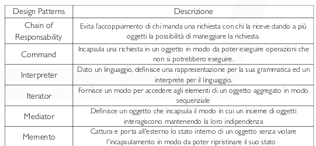

Vediamo qualche design pattern:

- **adapter**, che converte l’interfaccia di una classe in un’altra interfaccia richiesta dal client (quindi permette la cooperazione di classi che altrimenti avrebbero interfacce incompatibili. Infatti in alcune circostanze non si può utilizzare una classe già esistente solo perché quest’ultima non comunica più con una interfaccia specializzata richiesta da un’a)pplicazione. Si deve utilizzare una classe esistente la cuiinterfaccia sia incompatibile e creare una classe (riusabile) che dovrà collaborare con classi non prevedibili al momento della sua creazione:
  
  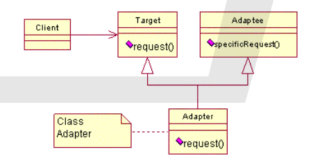
  
  - **target:** definisce l’interfaccia specializzata usata dal client 
  
  - **client:** collabora con oggetti conformi all’interfaccia target
  
  - **adaptee:** definisce una interfaccia che deve essere resa conforme
  
  - **adapter:** adatta l’interfaccia di Adaptee all’interfaccia Target
  
  Adapter ridefinisce (overrides) parte del comportamento di Adaptee; Prevede un rapporto di ereditarietà tra Adapter e Adaptee, in cui Adapter specializza Adaptee, pertanto non è possibile creare un Adapter che specializzi più Adaptee. Se esiste una gerarchia di Adaptee occorre creare una gereachia di Adapter.

- **strategy**, che dfinisce una famiglia di algoritmi, incapsula ognuno in una classe e li rende intercambiabili fra di loro. Questo permette di modificare gli algoritmi in modo indipendente dai client che ne fanno uso. Infatti in alcune circostanze sono necessari algoritmi diversi in situazioni diverse per risolvere lo stesso problema. Per dare più flessibilità all’implementazione, tali algoritmi non sono specificati in una sola classe, ma in classi diverse. In questo modo, algoritmi diversi possono essere utilizzati in momenti diversi. Inoltre, nuovi algoritmi sono facilmente inseribili. Si ha:
  
  
  
  - ConcreteStrategy: implementa l’algoritmo che usa l’interfaccia Strategy
  
  - Context: è configurata con un oggetto ConcreteStrategy e mantiene un riferimento verso questo; può specificare una interfaccia che permette alle Strategy di accedere ai propri dati
  
  Più classi correlate variano soltanto per il loro comportamento. Il patter permette la configurazione di una classe con più comportamenti.Per modellare la differenza fra diverse varianti dello stesso algoritmo. Esempio: il calcolo dell’ora per varie zone geografiche. Per nascondere all’utente strutture dati complesse e specifiche dell’algoritmo. Per evitare l’utilizzo di tanti “if ” in un algoritmo. Si crea una classe diversa per ogni possibile ramo. Si hanno i seguenti pro:
  
  - la definizione di famiglie di algoritmi
  
  - un’alternativa alla gerarchia di classi
  
  - eliminazione di tanti “if ”
  
  - scelta fra varie implementazioni
  
  e contro:
  
  - gli utenti diventano consapevoli dell’esistenza delle strategie
  
  - overhead di comunicazione fra Strategy e Context
  
  - incremento del numero di oggetti

- **composite**, che definisce gerarchie di classi. Il client tratta foglie e nodi allo stesso modo. L’aggiunta di nuovi tipi di nodi e foglie è molto semplice. Non è possibile utilizzare la tipizzazione per limitare il tipo di nodi (Leaf) che possono essere utilizzati come figli di un altro tipo di nodi (Composite). Quindi si occupa di omporre oggetti in strutture ad albero per rappresentare gerarchie tutto-parti, trattare uniformemente oggetti individuali e composti, catturare l’essenza ricorsiva della composizione:
  
  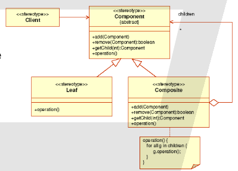
  
  - **component:**  dichiara l’interfaccia degli oggetti e il comportamento di default, dichiara un’interfaccia per l’accesso e la gestione dei suoi componenti figli
  
  - **leaf:**  rappresenta gli oggetti componenti senza figli e il loro comportamento 
  
  - **composite:** definisce il comportamento dei componenti figli, memorizza i componenti figli, implementa le operazione correlate ai figli definite dall’interfaccia Component
  
  - **client:** manipola gli oggetti della composizione utilizzando l’interfaccia Component
  
  Semplifica il client: il cliente può trattare strutture composte e singoli oggetti in modo uniforme. Rende più semplice l’aggiunta di nuove tipologie di componenti (nuove sottoclassi Leaf o Composite potranno essere utilizzate automaticamente nelle strutture esistenti e operare con il codice dei client). Può rendere il progetto troppo generico per la facile aggiunta di nuove componenti

- **singleton**, che si occupa di assicurare che una classe abbia una sola istanza con accesso globale:
  
  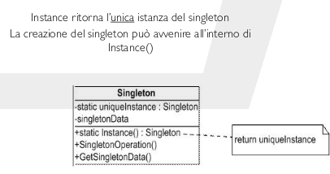
  
  si hanno i seguenti pro:
  
  - accesso controllato ad un’unica istanza
  
  - incapsula la creazione dell’oggetto
  
  - in alcune implementazioni possiamo gestire un pool di istanze invece che una singola istanza
  
  contro:
  
  - n alcune implementazioni, ogni volta che l’oggetto viene richiesto viene anche controllata la sua esistenza
  
  - Singleton non tratta la distruzione dell’oggetto

- **façade**, che nasconde ai client il sottosistema, si ha accoppiamento lasco fra sottosistemi differenti, è utile per migliorare l’integrazione tra componenti e fornisce un interfaccia unificata per una dato insieme di interfacce presenti in un sottosistema. Si usa con interfacce semplici per sottosistemi complesse in presenza di troppe dipendenze fra client e classi o una struttura a livelli in cui il Facade funge da entrata e uscita di ogni livello
  
  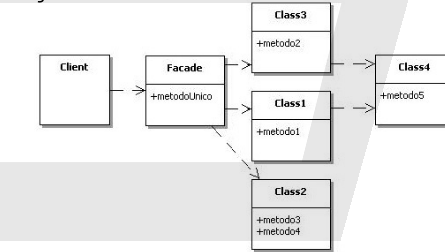
  
  Conosce la struttura del sottosistema e delega agli oggetti interni più appropriati le richieste provenienti dall’esterno. Quindi nasconde il sottosistema al Client, la complessità del sottosistema viene spostata all’ interno della classe Façade. Si disaccoppia il codice del Client dagli oggetti che si trovano dietro la Façade (Low coupling pattern). Più facile modificare il sottosistemaIndirection pattern. Fornisce Protected Variations da cambiamenti nell’ implementazione del sottosistema. Promuove portabilità, modularità, riusabilità del codice e non è necessario che Façade rappresenti una barriera impenetrabile per il Client. Si hanno i seguenti vantaggi:
  
  - nmasconde ai client i componenti del sottosistema, riducendone così la complessità
  
  - consente di modificare i componenti del sottosistema senza il coinvolgimento dei client
  
  Nel complesso espone interfaccia "a grana grossa"(coarse-grained) unificata e omogenea (e quindi semplificata) del business tier

- **observer**, che definisce una relazione 1-N tra oggetti in modo che quando un oggetto cambia stato, tutti gli oggetti che dipendono da esso siano notificati e aggiornati automaticamente. Si usa quando un astrazione ha due aspetti, uno dipendente dall’altro. Implementare questi aspetti in oggetti separati permette al programmatore di modificarli e di riutilizzarli indipendentemente. Quando il cambiamento di stato di un oggetto implica il cambiamento di stato di altri oggetti e non è noto in anticipo il numero degli oggetti che dovranno essere cambiati. Quando un oggetto deve essere in grado di notificare il proprio cambiamento di stato ad altri oggetti senza conoscere quali siano tali oggetti. Si ha:
  
  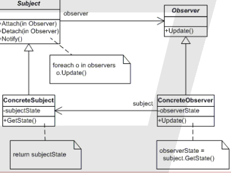
  
  - **Subject:** che conosce i suoi osservatori che possono essere di un numero indefinito e fornisce un’interfaccia per aggiungere o eliminare oggetti Observer
  
  - **Observer:** che definisce un’interfaccia di aggiornamento che deve essere avvisata dei cambiamenti di un Subject
  
  - **ConcreteSubject:** che contiene valori di interesse per gli oggetti ConcreteObserver . Invia un avviso ai suoi osservatori quando il suo stato cambia
  
  - **ConcreteObserver:** chef a riferimento a un oggetto ConcreteSubject. Il suo stato deve restare coerente con quello del soggetto.Implementa l’interfaccia per l’aggiornamento della classe Observer per mantenere il suo stato coerente con quello del soggetto
  
  Permette di variare i Subject e gli Observer indipendentemente; è possibile riutilizzare i soggetti senza il riutilizzo dei loro osservatori, e viceversa

- **factory method,** che si occupa di definire un’interfaccia per creare oggetti, ma lasciare alle sottoclassi la decisione del tipo di classe da istanziare. Infatti si deve gestire la creazione degli oggetti e il responsabile della creazione sa quando creare l’oggetto, ma non sa a priori quale tipo di oggetto deve essere creato. Si usa quando:
  
  - una classe non è in grado di anticipare la classe degli oggetti che deve creare 
  
  - una classe vuole che siano le sue sottoclassi a specificare gli oggetti che crea 
  
  - si vuole conoscere la classe alla quale è stata delegata la responsabilità della creazione
  
  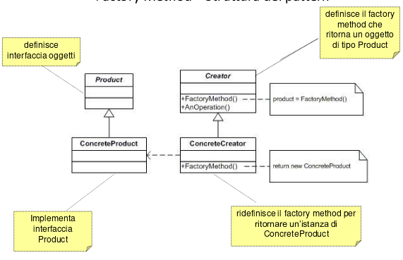
  
  La classe Creator affida alle sue sottoclassi la definizione del FactoryMethod in modo da ritornare l’istanza appropriata del ConcreteProduct. Utilizzare un metodo Factoryper la creazione di oggetti in una classe fornisce sempre una flessibilità maggiore rispetto alla creazione diretta dell’oggetto. Il pattern FactoryMethodfornisce alle sottoclassi un punto di aggancio per la produzione di una versione specializzata di un oggetto
  
  


## REFACTORING

- ***extract method***, meglio avere più metodi che troppa roba in un solo metodo
  
  ```java
  void printOwing() {
    printBanner();
  
    // Print details.
    System.out.println("name: " + name);
    System.out.println("amount: " + getOutstanding());
  }
  
  \\ to
  
  void printOwing() {
    printBanner();
    printDetails(getOutstanding()); 
  }
  
  void printDetails(double outstanding) {
    System.out.println("name: " + name);
    System.out.println("amount: " + outstanding);
  }
  ```
- ***move method***, se un metodo è usato più in un'altra classe allora lo sposto lì
- ***rename method***, per rinominare un metodo
- ***move field***, per spostare gli attributi in maniera intelligente
- ***extract class***, se una classe fa le cose di due separo la seconda classe con i metodi necessari

## CODE SMELL

- ***duplicate code***, se ho lo stesso codice in più metodi uso l'*extract method* 
  
  per estrerre quel codice e lo chiamo in più punti

- ***long method***, quando si ha un metodo troppo lungo, uso *extract method* e se
  
  non posso estraggo il metodo in un'altra classe:
  
  ```java
  class Order {
  // ...
  public double price() {
    double primaryBasePrice;
    double secondaryBasePrice;
    double tertiaryBasePrice;
    // Perform long computation.
  }
  }
  
  // to
  
  class Order {
   // ...
   public double price() {
   return new PriceCalculator(this).compute();
   }
  }
  
  class PriceCalculator {
   private double primaryBasePrice;
   private double secondaryBasePrice;
   private double tertiaryBasePrice;
  
  public PriceCalculator(Order order) {
   // Copy relevant information from the
   // order object.
   }
  
  public double compute() {
   // Perform long computation.
   }
  }
  ```

- ***feauture envy***, se una metodo in una classe usa spesso metodi e dati di un'altra classe uso *extract method* e *move method* e *move field* per spostare gli attributi

- ***large class***, se ho una classe troppo lunga la spacco con *extract class* e *extract subclass* con ovviamente *move field*

- ***switch statement***, se ho uno *switch* complicato o una sequenza di *if else* isoliamo il codice con *extract method* e *move method*. Posso usare anche *extract subclass* prima di isolare e procedere

- ***data class***, ovvero una classe con solo variabili di classe e getter/setter. Uso *move method* per spostare i metodi delle altre classi che usano la data class dentro la data class stessa

- ***long parameter list***, quando ho troppi argomenti per un metodo. Risolvo sostitutendo i parametri con metodi getter contentuti nel codice del metodo oppure passando un oggetto singolo e non i singoli parametri dell'oggetto

- ***shotgun surgery***, se la modifica di una classe è significativa per molte classi figlie. Per il refactor uso *move method* e *move field* per spezzare la classe madre

- ***comments***, devono essere corti e pochi, con codice auto esplicativo. Se ho un codice che bnon permette questi commenti uso *rename method* e *extracxt method*. Uso *insert assertion* per aiutare a rendere il codice auto esplicativo

# TESTING

## CATEGORY PARTITION

1. identificare le categorie per ogni parametro, ovvero le caratteristiche elementari
2. per ogni categoria identificare individuo i valori significativi, che possono essere considerazioni numeriche o logiche 
3. per ogni valore significativo identifico i vincoli con [property] e [if-property] [error] [single] (se da testare una volta sola)

## PROCESSO

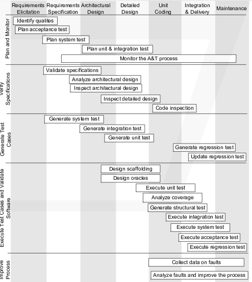


